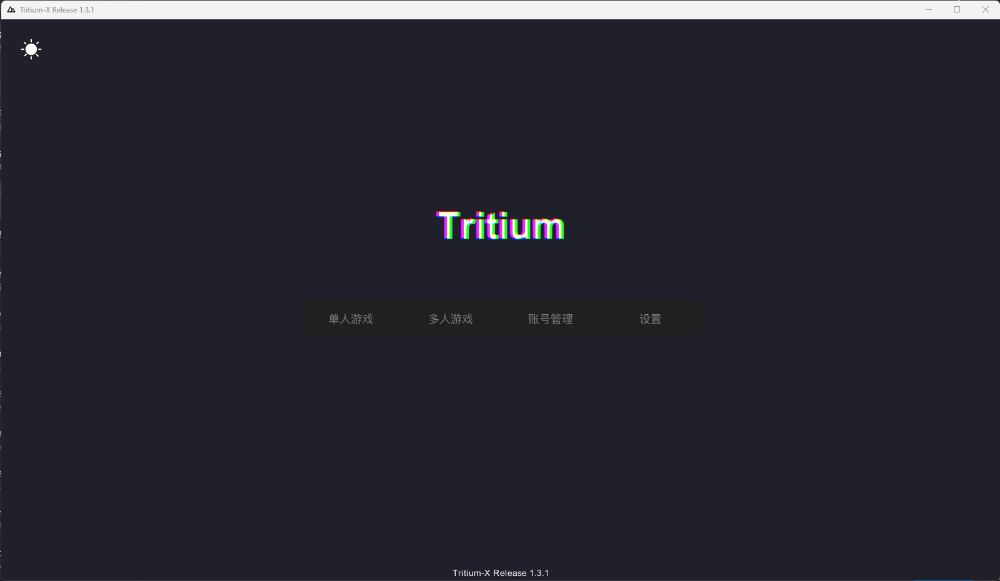
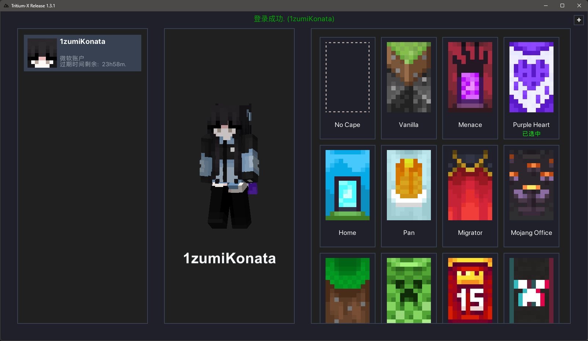
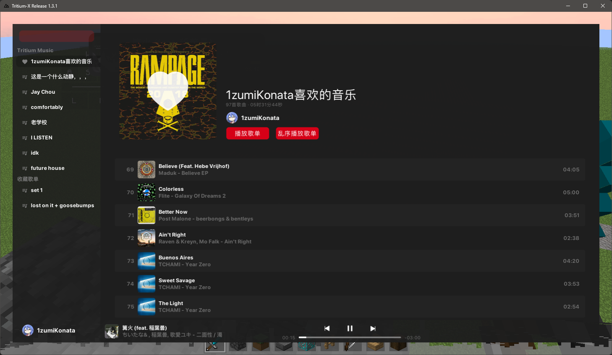
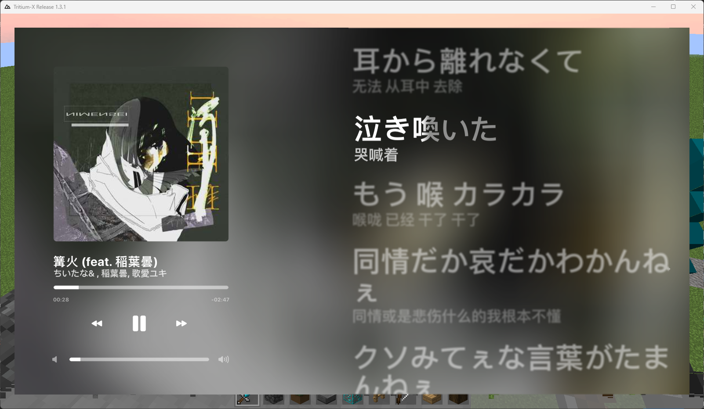

 
 <h1>Tritium-X</h1>

> 你直接 rename 我的端子发出来或者倒卖你妈必死  
> 你有什么问题你可以加入 `617399255` 找我问

### Tritium-X 是一个开源的 Minecraft 1.8.9 客户端。
___

## 亮点  
- **快速**：本客户端使用了一个经过深度优化的 mcp919 base, 移除了
  - Twitch 直播
  - Snooper
  - Profiler
  - 成就系统
  - OptiFine 反射
  - ...更多香草狗屎
- **低内存占用**
- **插件支持**：实现了 **部分** Opai 扩展 API
- 更多内容自己看，我忘了。

## [插件编写](https://github.com/IzumiiKonata/tritium-extension-template)

# 更多注意事项
- 本客户端中的某些功能仅为 `Windows` 平台编写，如果你想跨平台运行的话请自行更改代码。
- 为了修复高鼠标回报率导致的卡顿，我编译了一份 `glfw` 的最新最热版本，放在 `src/main/resources/windows/x64/org/lwjgl/glfw/glfw.dll` 中。
- 更多狗屎我忘了。

# Opai 扩展 API 支持
| 模块                                                                                        | 状态    |
|-------------------------------------------------------------------------------------------|-------|
| `addFriend` / `removeFriend` / `isFriend`                                                 | `未实现` |
| `addTarget` / `removeTarget` / `isTarget`                                                 | `未实现` |
| `OpenAPI.loadConfig(String)`                                                              | `未实现` |
| `IRC`                                                                                     | `未实现` |
| `HypixelAPI`                                                                              | `未实现` |
| `GameStateManager`                                                                        | `未实现` |
| `ShaderUtil`                                                                              | `未实现` |
| `Notification`                                                                            | `未实现` |
| `EventHandler.onStrafe(EventStrafe)`                                                      | `未实现` |
| `ItemUtil.fromData(String name, int count, int meta, String nbt)`                         | `未实现` |
| `RotationManager.applyRotation(RotationData rotationData, int speed, boolean correction)` | `未实现` |
| `Entity API`                                                                              | `✅`   |
| `World API`                                                                               | `✅`   |
| `Options API`                                                                             | `✅`   |
| `ValueManager`                                                                            | `✅`   |
| `ModuleManager`                                                                           | `✅`   |
| `RenderUtil`                                                                              | `✅`   |
| `FontUtil`                                                                                | `✅`   |
| `GLStateManager`                                                                          | `✅`   |
| `PacketUtil`                                                                              | `✅`   |

## Screenshots

<b>Main Menu</b>

<b>Alt Manager</b>

<b>Click Gui</b>

<b>Music Screen</b>

<b>Lyrics</b>

<b>Resourcepack Preview</b>

